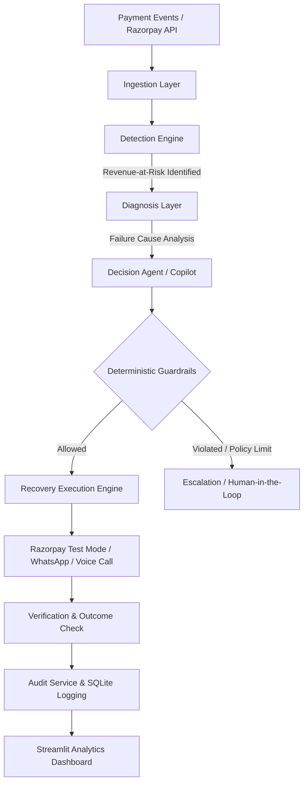

# RecoverAI – AI Revenue Recovery Agent

**Hackathon Track:** Razorpay AI Buildathon 2026 – Track 03: AI Revenue Recovery

---

## 🎯 Goal
Detect revenue at risk, diagnose the likely cause, choose a bounded recovery action, execute it through test-mode integrations (Razorpay API / WhatsApp / Voice Agent), verify the outcome, and maintain an immutable, auditable log.

---

## 🏗️ System Architecture



### Key Architectural Components

1. **Ingestion & Razorpay Sync Layer**: Ingests payment attempt webhooks and synthetic transaction streams.
2. **Detection Engine**: Identifies payment failures, card expirations, subscription dunning states, and at-risk revenue.
3. **Diagnosis Layer**: Analyzes failure codes (e.g., `INSUFFICIENT_FUNDS`, `EXPIRED_CARD`, `GATEWAY_ERROR`) to determine root causes.
4. **Decision Agent & Copilot**: Recommends optimal recovery pathways (smart retry scheduling, customer notification via WhatsApp/Voice, grace period extension).
5. **Deterministic Guardrails**: Enforces hard boundaries (maximum retry limits, cool-down periods, cost caps, explicit user consent checks).
6. **Recovery Execution Engine**: Executes automated actions safely in Razorpay Test Mode, WhatsApp messaging, and AI Voice Agent interactions.
7. **Verification & Audit Service**: Confirms recovery status and writes immutable audit logs for every decision and transaction.
8. **Dashboard & Metrics**: Provides real-time visibility into recovered revenue, recovery success rates, and guardrail intervention metrics.

---

## 🔄 Core Workflow & Lifecycle

```
[Detect] ➔ [Diagnose] ➔ [Decide] ➔ [Guardrail Validation] ➔ [Act] ➔ [Verify] ➔ [Audit] ➔ [Report/Escalate]
```

1. **Detect**: Catch failed or pending payment events in real-time.
2. **Diagnose**: Determine the exact failure classification and probability of recovery.
3. **Decide**: Select the appropriate recovery action (e.g., retry timing, messaging channel).
4. **Guardrail Check**: Verify that retry counts, intervention velocity, and financial caps are respected.
5. **Act**: Execute payment retries via Razorpay APIs or trigger customer communications.
6. **Verify**: Check transaction completion status.
7. **Audit**: Log every agent reasoning step, API request, and state transition.
8. **Escalate**: Route complex or persistent failures to human operators.

---

## 📅 3-Day Implementation Plan

### Day 1 – Data & Detection Engine
- Generate and import synthetic payment failure event streams.
- Build the core revenue-at-risk detection engine (`app/services/detector.py`).
- Implement held-out evaluation splits and establish precision/recall baselines.
- Define database schema for transaction logs, recovery actions, and audit events.

### Day 2 – Agent Intelligence & Recovery Workflow
- Build the diagnosis engine (`app/services/diagnoser.py`) and failure classification system.
- Integrate LLM decision-making (`app/services/decision_agent.py` & `copilot.py`).
- Implement deterministic guardrails (`app/services/guardrails.py`) for hard policy enforcement.
- Connect Razorpay test-mode API clients, WhatsApp notifications, and Voice Agent triggers.
- Build the immutable audit logger (`app/services/audit.py`).

### Day 3 – Dashboard, Metrics & Evaluation
- Develop the interactive Streamlit analytics dashboard (`app/dashboard.py`).
- Visualize total recovered revenue, success rates, and active dunning pipelines.
- Implement failure analysis views and guardrail intervention reporting.
- Evaluate model metrics: precision, recall, recovery rate, and false intervention cost.
- Prepare live demo scenarios and pitch deck artifacts.

---

## 🧪 Demo Scenarios

The test suite and dashboard demonstrate 5 core scenarios:
1. **Temporary Gateway Failures**: Bounded smart retries resulting in successful payment recovery.
2. **Insufficient Funds**: Friendly automated reminder sent; avoids repetitive spam charges.
3. **Unknown/Complex Failures**: Gracefully escalated to human support.
4. **Retry-Limit Breach**: Automatically blocked by guardrails when retry threshold is reached.
5. **Complete Auditability**: Complete step-by-step audit logs available for every action.

---

## 🛠️ Tech Stack
- **Language & Core**: Python 3.12, FastAPI
- **Frontend / Dashboard**: Streamlit
- **Data & ML**: Pandas, NumPy, Scikit-Learn
- **Integrations**: Razorpay Test Mode APIs, Twilio / WhatsApp API, Webhooks
- **Database & Storage**: SQLite / PostgreSQL
- **DevOps**: Docker, pytest

---

## 📊 Key Evaluation Metrics
- **Detection Precision & Recall**: Accuracy of identifying at-risk revenue.
- **Recovery Success Rate**: Percentage of failed transactions successfully recovered.
- **Total Revenue Recovered**: Cumulative monetary value recovered.
- **Guardrail Violations Prevented**: Count of unsafe automated actions intercepted.
- **Average Recovery Time**: Time taken from failure detection to resolution.


